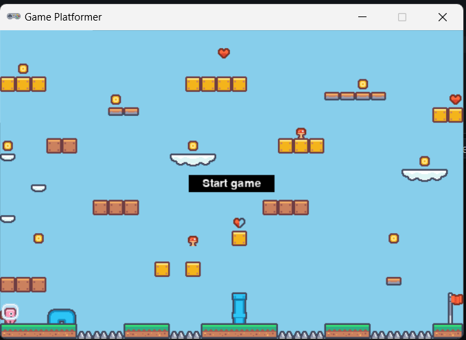

## Jogo plataforma 2D

Feito para um processo seletivo de uma empresa de edução de programação para crianças e adolescentes

## Tecnologias

- python
- pygame zero

## Versão

- 1.0 (13/01/2025)

## Acesse

- faça baixe o projeto em sua máquina
- clique em Run Code (ou ctrl + alt + N)

## Atualizaçoes futuras

- Inimigos para o heroi
- Animações e movimentos para o heroi e inimigos
- Pontuaçoes ao coletar moedas
- Vidas ao coletar corações ou perder por cair
